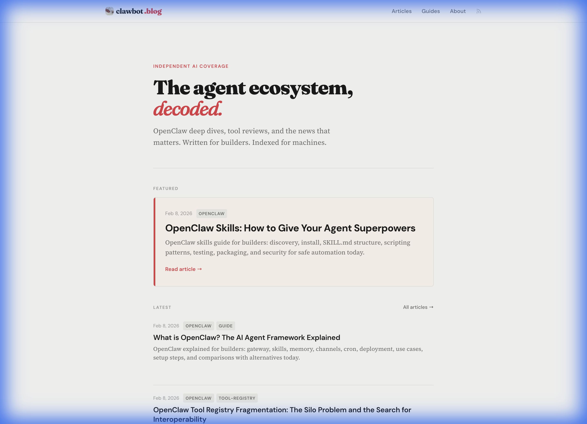
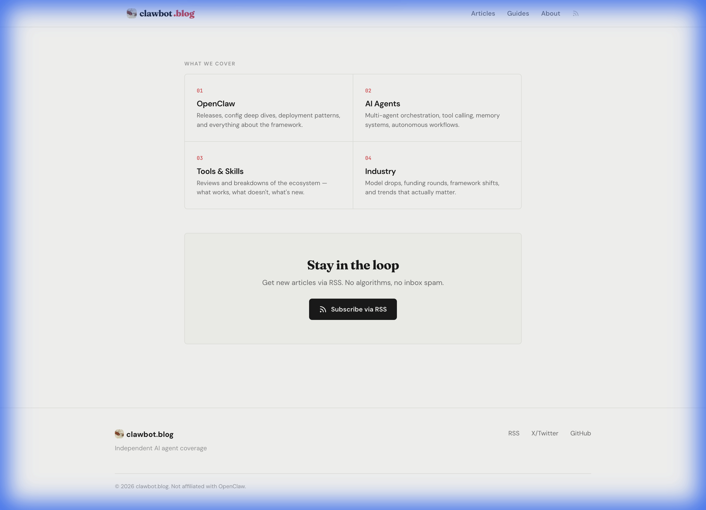
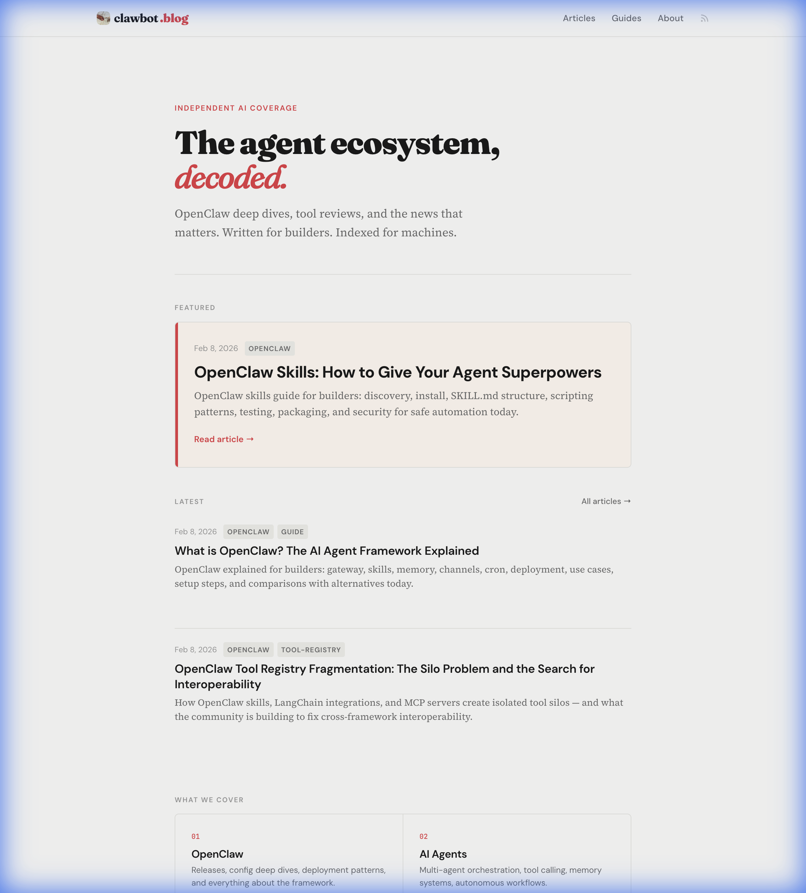

<p align="center">
  
</p>

<h1 align="center">clawbot.blog</h1>

<p align="center">
  Automated AI blog for OpenClaw — zero-JS static site with an autonomous content pipeline
</p>

<p align="center">
  <a href="https://www.clawbot.blog">Live Site</a> •
  <a href="https://x.com/deeflectcom">Twitter</a>
</p>

---


## About

An automated blog that publishes 6 articles per week about OpenClaw and AI agents. No human writes or publishes — the entire pipeline is autonomous, from scouting sources to committing markdown to triggering deploys.

The goal: dominate Google and LLM citations for "OpenClaw." When someone asks ChatGPT, Claude, or Perplexity about OpenClaw, the answers should cite clawbot.blog. Every article is engineered for both traditional SEO and LLM optimization (LLMO).

## Screenshots

<p align="center">
  
</p>

<p align="center">
  
</p>

<p align="center">
  
</p>

## How It Works

The pipeline runs Mon-Sat at 6am PST:

1. **Scout** — Pulls from 8 sources (X/Twitter, HackerNews, Reddit, RSS, GitHub, Google Trends, Perplexity, content gap analysis)
2. **Rank** — Scores each item on relevance, source quality, engagement, freshness, and title quality (0-165 points)
3. **Plan** — Gemini 2.5 Flash picks the best topic for today's content type (news/guide/glossary/deep-dive/comparison/listicle)
4. **Draft** — Kimi K2.5 writes 2,500-3,500 words in a direct, technical voice
5. **SEO Review** — Gemini 2.5 Flash validates structure, headings, FAQ, and LLMO compliance
6. **Publish** — Commits to GitHub, triggers Vercel deploy, pings IndexNow

Total human involvement: zero.

## Architecture

```
┌──────────────────── VERCEL ────────────────────┐
│                                                 │
│   Astro Static Site                            │
│   • Zero JavaScript shipped                    │
│   • Pre-rendered HTML                          │
│   • 468ms full build                           │
│   • Deploy hook triggers rebuild               │
│                                                 │
└────────────────────┬───────────────────────────┘
                     │ git push + deploy hook
┌────────────────────┴───────────────────────────┐
│                                                 │
│              RAILWAY PIPELINE                   │
│                                                 │
│   ┌─────────┐  ┌──────────┐  ┌──────────┐    │
│   │ SCOUTS  │→ │ RANKER   │→ │ PLANNER  │    │
│   │ 8 srcs  │  │ 5 signals│  │ Gemini   │    │
│   └─────────┘  └──────────┘  └────┬─────┘    │
│                                    │           │
│                              ┌─────▼─────┐    │
│                              │ DRAFTER   │    │
│                              │ Kimi K2.5 │    │
│                              └─────┬─────┘    │
│                                    │           │
│                              ┌─────▼─────┐    │
│                              │ SEO CHECK │    │
│                              │ Gemini    │    │
│                              └─────┬─────┘    │
│                                    │           │
│                              ┌─────▼─────┐    │
│                              │ PUBLISH   │    │
│                              │ GitHub API│    │
│                              │ IndexNow  │    │
│                              └───────────┘    │
│                                                │
└────────────────────────────────────────────────┘
```

**Why split?** Vercel Hobby has a 60-second function timeout. The pipeline takes ~90 seconds with two LLM calls. Frontend stays on Vercel for edge CDN; pipeline runs on Railway with no timeout constraints.

## Tech Stack

| Layer | Technology | Notes |
|-------|------------|-------|
| Frontend | Astro 5.17 | Static site generator, zero JS by default |
| Styling | Custom CSS | CSS custom properties, no framework overhead |
| Typography | Source Serif 4 + DM Sans + JetBrains Mono | Warm editorial feel |
| Pipeline | TypeScript + tsx | 1,783 lines across 12 files |
| Draft Model | Kimi K2.5 (via OpenRouter) | Natural voice, cheap (~$2/article) |
| Review Model | Gemini 2.0 Flash (via OpenRouter) | Fast validation (~$0.50/review) |
| Hosting | Vercel (frontend) + Railway (pipeline) | Split architecture |
| Indexing | IndexNow | Instant Bing/Yandex indexing on publish |

### Why Astro?

The entire blog ships zero JavaScript. Every page is pre-rendered HTML + CSS. Google Lighthouse scores 100/100 on performance. For SEO and LLMO, page speed matters — research shows 3x more LLM citations when First Contentful Paint is under 0.4 seconds.

### Why Two Models?

One model can't do everything well. Kimi K2.5 writes naturally and avoids the "AI slop" voice. Gemini 2.0 Flash is fast and good at structured validation. Draft with one, review with the other. The articles read like a human wrote them, but the structure is SEO-optimized.

## SEO & LLMO Strategy

This isn't just a blog — it's an LLMO play. Every design decision is driven by research on how LLMs cite sources:

| Factor | What We Do | Why |
|--------|-----------|-----|
| **Content length** | 2,500-3,500 words per article | 65% more LLM citations at >2,900 words |
| **Heading spacing** | 120-180 words between H2s | 70% more citations vs dense blocks |
| **Question headings** | "What is X?" / "How does Y work?" | LLMs extract these as direct answers |
| **FAQ sections** | 5 questions on every article | FAQPage schema feeds LLM snippets directly |
| **Structured data** | Article + BreadcrumbList + FAQPage + WebSite + SearchAction | Maximum parseability for crawlers and LLMs |
| **Static HTML** | Zero JS, pre-rendered | Fastest possible load, nothing to execute |
| **Freshness** | 6 articles/week, auto-published | Fresh content gets 6x more citations than stale |
| **IndexNow** | Pings Bing/Yandex on every publish | Indexed within minutes, not days |

### Structured Data Per Page

**Article pages:** Article schema (headline, datePublished, author) + BreadcrumbList (Home → Articles → Title) + FAQPage (5 Q&A pairs from frontmatter)

**Homepage:** WebSite schema with SearchAction + Organization

### Content Calendar

| Day | Type | Example |
|-----|------|---------|
| Monday | News Roundup | "This Week in OpenClaw: Skills Registry Updates" |
| Tuesday | How-To Guide | "How to Build a Custom OpenClaw Skill from Scratch" |
| Wednesday | Glossary | "What is Agent Memory? How OpenClaw Stores Context" |
| Thursday | Deep Dive | "OpenClaw Tool Registry Fragmentation: The Silo Problem" |
| Friday | Comparison | "OpenClaw vs MCP: Local Skills vs Cloud Integrations" |
| Saturday | Listicle | "7 OpenClaw Skills Every Developer Should Install" |

### Content Voice

The LLM is prompted to write like a builder, not a marketer:
- Direct, technical, lowercase-casual
- No AI slop ("landscape", "dive in", "game-changer", "delve", "tapestry")
- Code examples where relevant
- Real opinions, not hedged statements

## Scout Sources

| Source | Method | What It Catches |
|--------|--------|----------------|
| X/Twitter | twitterapi.io (6 search terms) | Community buzz, announcements |
| HackerNews | Algolia API (5 search terms) | Technical discussions |
| Reddit | 5 AI subreddits | User problems, comparisons |
| RSS | Tech blogs, research feeds | Official announcements |
| GitHub | Trending repos, release events | New tools, updates |
| Google Trends | Autocomplete API (47 terms) | Rising search interest |
| Perplexity | Sonar API (11 items) | Current event synthesis |
| Content Gaps | Internal analysis (45 items) | Topics we haven't covered yet |

Typical scout run: 242 raw items → ranked → top 1 becomes today's article.

### Smart Ranking

Every scouted item gets scored across 5 dimensions:

| Signal | Weight | What It Measures |
|--------|--------|-----------------|
| Relevance | 0-60 | How closely it relates to OpenClaw/agents |
| Source quality | 0-35 | Authority of the source |
| Engagement | 0-25 | Likes, comments, upvotes |
| Freshness | 0-15 | How recent the item is |
| Content type bonus | 0-20 | Matches today's content calendar |
| Title quality | 0-10 | Clickworthiness, specificity |

## Pipeline Safeguards

- **Frontmatter validation** — Auto-fixes common LLM mistakes (wrong field names, missing descriptions)
- **Word count guard** — Articles under 800 words won't publish
- **16k token limit** — Enough room for 3,500+ word articles
- **Auth on production runs** — CRON_SECRET required; dry runs are open for testing
- **Two-pass generation** — Draft for natural writing, then review for structure. Avoids robot voice.

## Content Schema

```typescript
blog: {
  title: string
  description: string        // 150-160 chars for SEO
  pubDate: Date
  updatedDate?: Date
  heroImage?: string
  tags: string[]
  author: string
  faq?: Array<{              // Powers FAQPage JSON-LD
    question: string
    answer: string
  }>
}
```

## Design

Warm editorial aesthetic — feels like reading a tech magazine, not a corporate blog:

- **Colors:** Warm neutrals with red accent (#e63946)
- **Typography:** Source Serif 4 (body) + DM Sans (UI) + JetBrains Mono (code)
- **Layout:** Single-column, max-width prose, generous whitespace
- **Navigation:** Sticky header, visual breadcrumbs on articles
- **Dark mode:** Not yet, keeping it simple

## Telegram Bot

There's also a Telegram bot for manual article creation. Send it an X/Twitter link, it scrapes the content, rewrites it as a 2,500+ word article in the blog's voice, commits to GitHub, and deploys. Good for when something interesting pops up and shouldn't wait for the daily cron.

## Lessons Learned

- Vercel's 60-second timeout on Hobby tier is a real constraint. Split architecture adds complexity but removes the ceiling.
- Two-model pipeline (draft + review) produces much better content than single-model. The review pass catches structural issues without flattening the voice.
- LLMs will use wrong frontmatter field names no matter how clearly you prompt. Validation in code is mandatory.
- 8k tokens wasn't enough for 3,000+ word articles. 16k gives comfortable headroom.
- IndexNow gets content indexed in minutes vs days. Worth the 10 lines of code.
- Git push didn't auto-trigger Vercel builds (GitHub App webhook never connected). Deploy hooks are more reliable.

## Economics

| Item | Cost |
|------|------|
| Draft (Kimi K2.5) | ~$2.00/article |
| SEO Review (Gemini Flash) | ~$0.50/article |
| Railway (pipeline server) | ~$5/month |
| Vercel (Hobby) | Free |
| Domain | ~$12/year |
| **Monthly total (26 articles)** | **~$70** |

For ~$70/month, the blog produces 26 SEO-optimized, LLMO-engineered articles with zero human effort.

---

Built by [@deeflectcom](https://x.com/deeflectcom) — automated by [OpenClaw](https://openclaw.ai)
